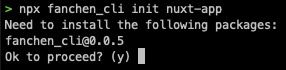
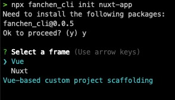
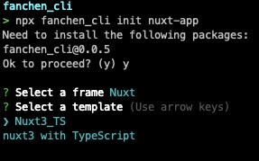
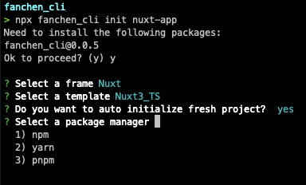
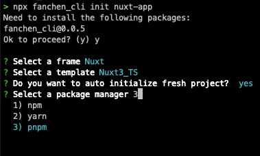
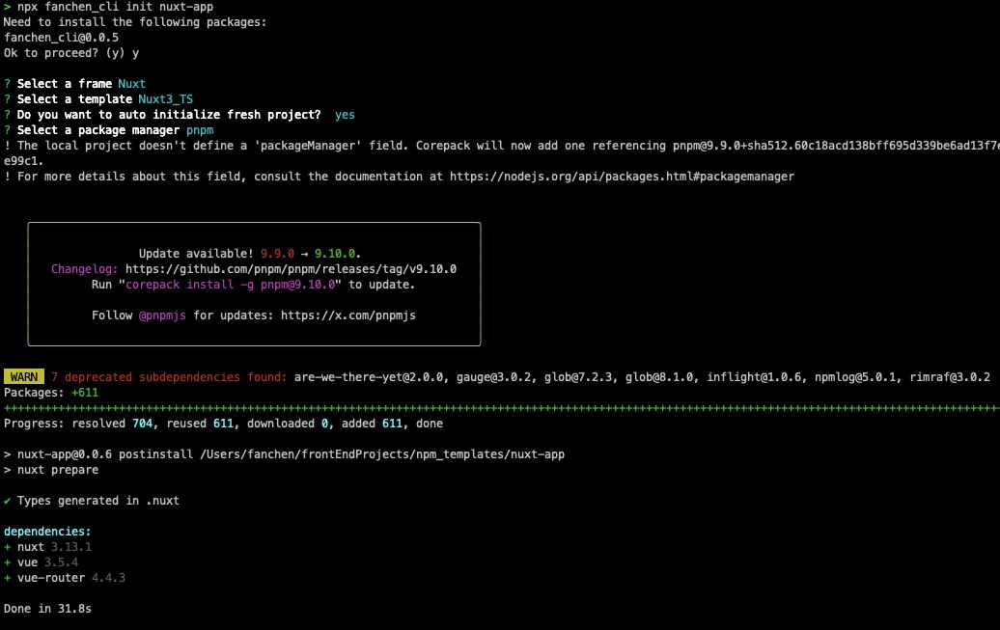
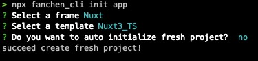

# FanChen_CLI

Vue、Nuxt 自定义脚手架模板

| Frame  | TemplateName       | Description            |
|:-------|:-------------------|:-----------------------|
| Vue    | Based-Element_Vue2 | 基于 Element-UI 二次开发的组件库 |
| Nuxt   | Nuxt3_TS           | Nuxt3 with TypeScript  |

### **注：使用该脚手架命令时，请保证 node 版本 >= 18**

<!-- TOC -->
* [FanChen_CLI](#fanchen_cli)
  * [Usage](#usage)
  * [Setup](#setup)
  * [Development Server](#development-server)
  * [Production](#production)
<!-- TOC -->

## Usage

```shell
npx fanchen_cli init <project_name>
```


``第一步：选择框架``



``第二步：选择模板``**[不同模板运行时所需的 node 版本可能存在差异]**




``第三步：选择是否自定初始化项目``**[Y: 流转到第四步; N: 直接按照模板创建项目]**




``第四步：选择包管理器``**[选择已存在的包管理器]**




``🚀🚀🚀恭喜创建成功[第三步选: Y]``



``🚀🚀🚀恭喜创建成功[第三步选: N]``



## Setup

安装起步依赖

```shell
# 别忘了切换到项目目录哦
cd <project_name>

# npm
npm install

# pnpm
pnpm install

# yarn
yarn install
```

## Development Server

本地开发服务默认运行地址 http://localhost:3000

```shell
# npm
npm run dev

# pnpm
pnpm run dev

# yarn
yarn dev
```

## Production

构建用于生产的应用程序

```shell
# npm
npm run build

# pnpm
pnpm run build

# yarn
yarn build
```

构建用于本地预览生产应用

```shell
# npm
npm run preview

# pnpm
pnpm run preview

# yarn
yarn preview
```